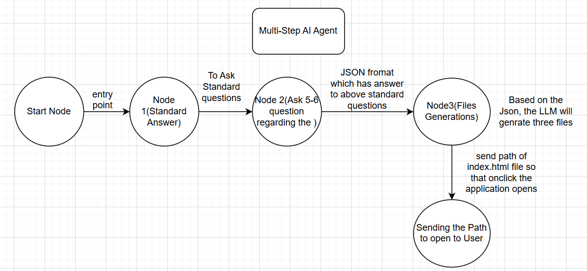

# 🎮 Game Builder AI

An **agentic AI system** that designs and generates playable HTML/CSS/JavaScript
browser games from natural-language descriptions.  Built with **LangGraph**,
**FastAPI**, **Streamlit**, and the **Groq** inference API.



---

## Table of Contents

1. [Architecture](#architecture)
2. [Agent Phases](#agent-phases)
3. [Project Structure](#project-structure)
4. [Quick Start (Local)](#quick-start-local)
5. [Docker Build & Run](#docker-build--run)
6. [Configuration](#configuration)
7. [Trade-offs](#trade-offs)
8. [Improvements With More Time](#improvements-with-more-time)

---

## Architecture

```
┌──────────────┐  HTTP/JSON  ┌──────────────────────────────────────────────────┐
│  Streamlit   │◄───────────►│  FastAPI Backend                                 │
│  Frontend    │             │  ┌────────────────────────────────────────────┐  │
│  (port 8501) │             │  │  LangGraph Agent                           │  │
│              │             │  │                                            │  │
│  • Chat UI   │             │  │  START ─► classify ─┬─► clarify ──► END    │  │
│  • Phase     │             │  │                     ├─► plan ─► generate   │  │
│    indicator │             │  │                     │          ──► END     │  │
│  • Game      │             │  │                     └─► END (complete)     │  │
│    preview   │             │  │                                            │  │
│  • Downloads │             │  │  Checkpointer: MemorySaver (per session)   │  │
│              │             │  └────────────────────────────────────────────┘  │
└──────────────┘             │  ┌──────────┐                                    │
                             │  │ Groq API │ LLM calls (OpenAI-compatible)      │
                             │  └──────────┘                                    │
                             └──────────────────────────────────────────────────┘
```

| Component | Technology |
|-----------|-----------|
| Agent framework | **LangGraph** (StateGraph + MemorySaver checkpointer) |
| LLM provider | **Groq** (OpenAI-compatible, using `langchain-openai`) |
| Backend API | **FastAPI** (async, JSON REST) |
| Frontend | **Streamlit** (chat UI, previews, downloads) |
| Containerisation | **Docker** (single image, both services) |

---

## Agent Phases

| # | Phase | Node | What happens |
|---|-------|------|-------------|
| 1 | **Classify** | `classify_node` | Analyses conversation to decide if requirements are clear (`READY`) or need more info (`CLARIFY`). Caps at 3 rounds max. |
| 2 | **Clarify** | `clarify_node` | Asks 2-3 targeted follow-up questions about the game idea. Returns to user and waits. |
| 3 | **Plan** | `plan_node` | Produces a structured game-development plan (mechanics, controls, visuals, entities, etc.). |
| 4 | **Generate** | `generate_node` | Generates three complete files: `index.html`, `style.css`, `game.js`. Parsing supports both explicit delimiters and fenced code blocks. |

Each user message re-invokes the graph; the **MemorySaver** checkpointer
persists state across turns using `session_id` as the thread key.

---

## Project Structure

```
game_creator_ai/
├── main.py                       # Uvicorn entry-point
├── frontend.py                   # Streamlit chat UI
├── pyproject.toml                # Python project metadata & deps
├── Dockerfile                    # Single-container build
├── docker-compose.yml            # One-command run
├── .env.example                  # Environment variable template
├── .dockerignore
├── image.png                     # UI reference image
├── output/                       # Generated games saved here
└── src/
    └── app/
        ├── API.py                # FastAPI app factory
        ├── common/
        │   ├── settings.py       # Env-based configuration
        │   └── properties.py 
        ├── core/
        │   └── user_chat.py      # Orchestrates graph invocation
        ├── graph/
        │   ├── state.py          # GameState TypedDict
        │   ├── nodes.py          # classify / clarify / plan / generate
        │   └── graph.py          # StateGraph construction & compilation
        └── v1/
            ├── models/
            │   └── chat.py       # Pydantic request/response schemas
            └── routers/
                └── chat.py       # POST /v1/chat endpoint
```

---

## Quick Start (Local)

### Prerequisites

- Python 3.12+
- A [Groq](https://console.groq.com/) API key

### Steps

```bash
# 1. Clone the repository
git clone <repo-url> && cd game_creator_ai

# 2. Create a virtual environment
uv sync (if uv is not present "pip install uv")

# 4. Configure environment
cp .env.example .env
#    → edit .env and set GROQ_API_KEY

# 5. Start the FastAPI backend
python main.py &

# 6. Start the Streamlit frontend
streamlit run frontend.py --server.port 8501
```

Open **http://localhost:8501** in your browser.

---

## Docker Build & Run

### Option B – plain Docker

```bash
# Build
docker build -t game-builder-ai .

# Run
docker run --rm -it \
  -p 8000:8000 -p 8501:8501 \
  -e GROQ_API_KEY="gsk_your_key_here" \
  -v $(pwd)/output:/app/output \
  game-builder-ai

# Open http://localhost:8501
```

---

## Configuration

All settings are loaded from environment variables (`.env` file supported):

| Variable | Default | Description |
|----------|---------|-------------|
| `GROQ_API_KEY` | *(required)* | Your Groq API key |
| `GROQ_BASE_URL` | `https://api.groq.com/openai/v1` | Groq API base URL |
| `GROQ_MODEL_FAST` | `llama-3.1-8b-instant` | Model for classify & clarify (fast) |
| `GROQ_MODEL_POWER` | `openai/gpt-oss-20b` | Model for planning & generation (capable) |
| `BACKEND_URL` | `http://localhost:8000` | Backend URL for the Streamlit frontend |
| `OUTPUT_DIR` | `output` | Directory to save generated game files |

---

## Trade-offs

| Decision | Rationale |
|----------|-----------|
| **In-memory checkpointer** | Simplicity over durability — sessions are lost on restart. Acceptable for a demo; production would use Redis/Postgres. |
| **Single Docker container** | The assignment requires one container. A microservice split (separate backend & frontend containers) would be cleaner at scale. |
| **Synchronous graph invocation** | LangGraph's `invoke()` is blocking. For long-running generation, a WebSocket or SSE streaming approach would improve UX. |
| **Two-model strategy** (fast + power) | Faster responses for simple tasks (classify/clarify) while reserving the stronger model for code generation. |
| **Max 3 clarification rounds** | Prevents excessive questioning while still gathering enough info. Hardcoded limit — could be made dynamic. |
| **Regex-based file parsing** | Robust enough for structured LLM output but can break on unusual formatting. A structured-output / tool-call approach would be more reliable. |

---

## Improvements With More Time

1. **Persistent checkpointer** – Replace `MemorySaver` with a SQLite or Redis checkpointer for durable sessions.
2. **Clarifying Node wrap with LLM** - Right now I am giving fixed questions to user, but we can properly integrate with LLM and prompt to generate the JSON by LLM for Next node.
3. **Code validation node** – Add a post-generation node that lints the HTML/JS and attempts to fix errors.
4. **Multiple generation attempts** – Retry code generation with adjusted prompts if parsing fails.
5. **Structured output** – Use LLM tool-calling / function-calling to return files as JSON instead of parsing raw text.
6. **Multi-user support** – Proper auth, per-user session storage, and rate-limiting.
7. **Game template library** – Provide genre-specific code templates to improve generation quality.
8. **CI/CD pipeline** – GitHub Actions for lint, test, build Docker image, and push to registry.